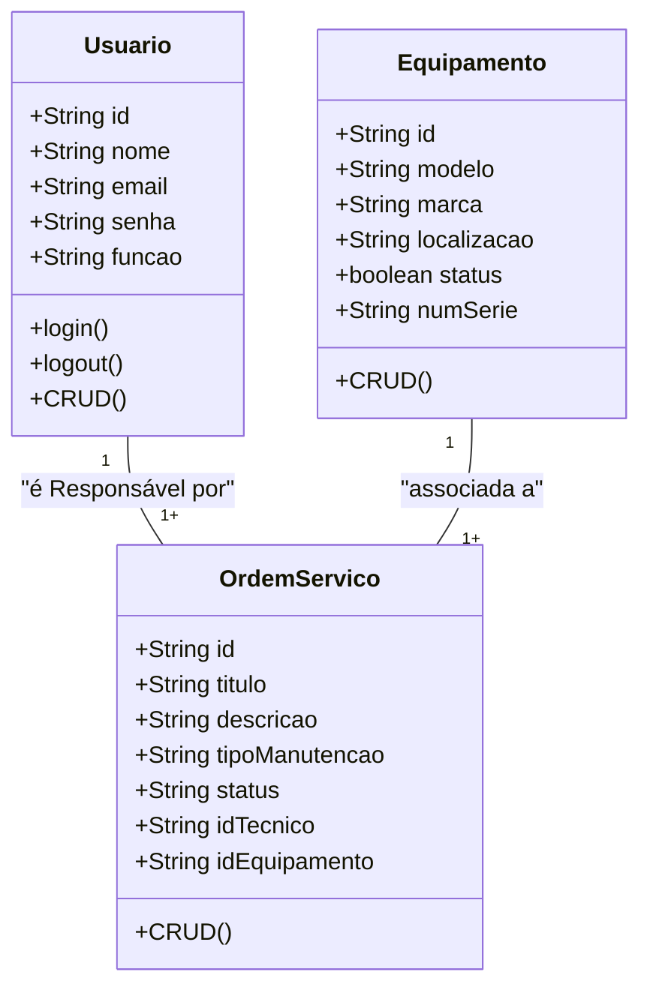

# Sistema de Gestão de Manutenção (SGM) - Formativa

## Briefing
O projeto consiste no desenvolvimento de um Sistema de Gestão de Manutenção (SGM) no formato de uma aplicação web. O objetivo é centralizar e otimizar o controle das atividades de manutenção de máquinas e equipamentos de uma empresa. A plataforma permitirá o cadastro de equipamentos, agendamento de manutenções preventivas e corretivas, e o gerenciamento de ordens de serviço.

## Objetivo do Projeto
- gerenciar informações sobre equipamentos e manutenção realizadas pela empresa
- realizar abertura de chamados de manutenção (ordens de serviço)
- dashboard de histórico de manutenção
- proteger acesso aos dados do sistema (cripitografia e autenticação segura de usuarios)

## publico-alvo
- tecnicos de manutenção (usuários finais)
- gerente de manutenção (usuário intemediários)
- administradores do sistema (gerenciar a permissão dos usuários)

## levantamento de requisitos do projeto
- ### Requisitos Funcionais
- ### Requisitos Não Funcionais

## Recursos do Projeto
  - ### Tecnológicos
      - Framework de Desenvolvimento Next/React
      - Linguagem de programação: typescript
      - Banco de dados: Não relacional (MongoDB)
      - GitHub
      - VsCode
      - Figma

    - ### pessoal
        -Dev Tudo

## Análise de Risco

## Diagramas

1. ### Classe
Descrever o comportamento das Entidades de um projeto
    - Usuário (User/Usuario)
        - Atributos: id, nome, email, senha, função
        - métodos:  create, read, update, delete, login, logout
    - Equipamento (Equipment)
         - Atributos: id, modelo, marca, localização, status, numeroSerie
         - Metodos: CRUD
    - Ordem de Servico (OrdemServico)
        - Atributos: id, titulo, deescricao, tipoManutencao, status, idTecnico, idEquipamento

