# Sistema de Gestão de Manutenção (SGM) - Formativa

## Briefing
O projeto consiste no desenvolvimento de um Sistema de Gestão de Manutenção (SGM) no formato de uma aplicação web. O objetivo é centralizar e otimizar o controle das atividades de manutenção de máquinas e equipamentos de uma empresa. A plataforma permitirá o cadastro de equipamentos, agendamento de manutenções preventivas e corretivas, e o gerenciamento de ordens de serviço.

## Objetivo do Projeto
- gerenciar informações sobre equipamentos e manutenção realizadas pela empresa
- realizar abertura de chamados de manutenção (ordens de serviço)
- dashboard de histórico de manutenção
- proteger acesso aos dados do sistema (cripitografia e autenticação segura de usuarios)

## publico-alvo
- tecnicos de manutenção (usuários finais)
- gerente de manutenção (usuário intemediários)
- administradores do sistema (gerenciar a permissão dos usuários)

## levantamento de requisitos do projeto
- ### Requisitos Funcionais
- ### Requisitos Não Funcionais

## Recursos do Projeto
  - ### Tecnológicos
      - Framework de Desenvolvimento Next/React
      - Linguagem de programação: typescript
      - Banco de dados: Não relacional (MongoDB)
      - GitHub
      - VsCode
      - Figma

    - ### pessoal
        -Dev Tudo

## Análise de Risco

## Diagramas

1. ### Classe
Descrever o comportamento das Entidades de um projeto
    - Usuário (User/Usuario)
        - Atributos: id, nome, email, senha, função
        - métodos:  create, read, update, delete, login, logout
    - Equipamento (Equipment)
         - Atributos: id, modelo, marca, localização, status, numeroSerie
         - Metodos: CRUD
    - Ordem de Servico (OrdemServico)
        - Atributos: id, titulo, deescricao, tipoManutencao, status, idTecnico, idEquipamento

```mermaid

classDiagram

    class Usuario{
        +String id
        +String nome
        +String email
        +String senha
        +String funcao
        +login()
        +logout()
        +CRUD()
    }

    class Equipamento{
        +String id
        +String modelo
        +String marca
        +String localizacao
        +boolean status
        +String numSerie
        +CRUD()
    }

    class OrdemServico{
        +String id
        +String titulo
        +String descricao
        +String tipoManutencao
        +String status
        +String idTecnico
        +String idEquipamento
        +CRUD()
    }


    Usuario "1"--"1+" OrdemServico: "é Responsável por"
    Equipamento "1"--"1+" OrdemServico: "associada a"

```

2. ### Caso de Uso
Ilustra as interações dos diferentes tipos de usuario (Atores) com as funcionalidades do sistema

- Caso de Uso:
   - Técnico: Gerenciar Ordens de Serviço (CRUD) e acessar o Dashboard
   - Gerente: funções do técnico + Gerenciamento de Equipamentos (CRUD);
   - Admin: Gerenciar Usuários do Sistema, acessae o dashboard

   Fazer o Login -> Antes de Qualquer ação

```mermaid

graph TD

    subgraph "SGM"
        caso1([Fazer Login])
        caso2([Gerenciar Ordens de Serviço - CRUD])
        caso3([Gerenciar Equipamentos - CRUD])
        caso4([Gerenciar Usuários])
        caso5([Acessar o DashBoard])
    end

    Tecnico([👩‍🔧Técnico de Manutenção])
    Gerente([Gerente de Manutenção])
    Admin([Administrador do Sistema])

    Tecnico --> caso1
    Tecnico --> caso2
    Tecnico --> caso5

    Gerente --> caso1
    Gerente --> caso2
    Gerente --> caso3
    Gerente --> caso5

    Admin --> caso1
    Admin --> caso4
    Admin --> caso5

    
    caso1 -.-> caso2
    caso1 -.-> caso3
    caso1 -.-> caso4
    caso1 -.-> caso5
```


 
 3. ### Fluxo
 Detalha o passo a passo para realizar uma ação no sistema

 - Diagrama de fluxo de Login
     - o usuario acessa a tela de login
     - Insere as credenciais
     - o sistema verifica as credenciais
         - se sim: ger um JWT (Token) => Dashboard
         - se não: manda uma mensagem de erro - Permanece na tela de login

```mermaid

graph TD
    A[Início] --> B{Acessa a Tela de Login}
    B --> C[Preencher Email e Senha]
    C --> D{Validar as Credenciais}
    D --> SIM --> E[Gerar um Token JWT]
    E --> F[DashBoard]
    D --> NÃO --> G[Mensagem de Erro]
    G --> B

https://www.figma.com/design/1ZAibE3u80pWZvpJ77OZIx/Untitled?node-id=0-1&t=3ze1AVu1pJ2DOcii-1
